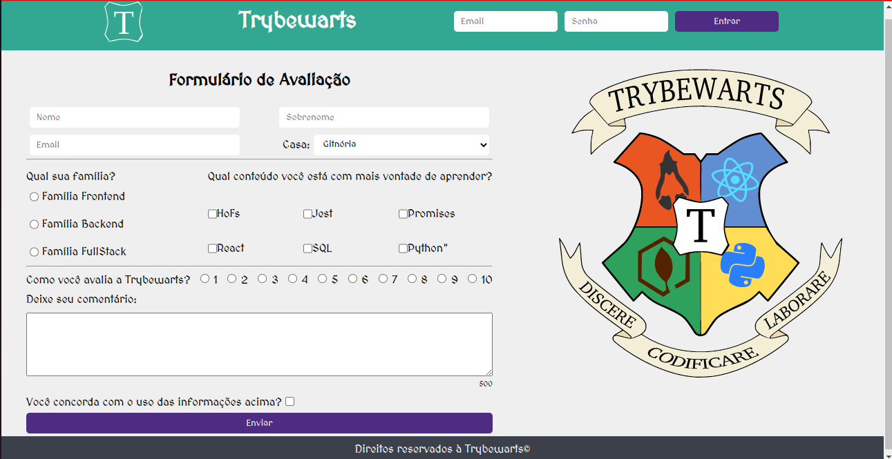

# Projeto 04 - TrybeWarts

Oi. Este foi um dos projetos que eu fiz durante meu curso na Trybe. Confira os detalhes dele abaixo.

## Nome do Projeto
TrybeWarts
## Linguagens e Ferramentas Utilizadas

 - JavaScript
 - HTML
 - CSS

## Objetivos do Projeto
Esse foi o primeiro projeto em grupo que eu realizei na Trybe. Meus companheiros de equipe foram: [Igor Arecippo](https://github.com/IgorArecippo) e [João Matheus](https://github.com/Joao-Matheus-Franca). Os objetivos didáticos deste projeto foram, em especial, aplicar o conhecimento de Forms adquirido, e também ter a primeira experência de trabalhar em um projeto em grupo. A página desenvolvida simula um formulário de avaliação, com temática de "Hoggwarts", do universo de Harry Potter, porém com adaptações para o tema de desenvolvimento web.

## Instruções para visualização
Comando para clonar o projeto:
 - `git clone git@github.com:BrunoSayago/projeto-04-TrybeWarts.git`
 
Se necessário, instalar as dependências:
 - `npm install`
  
O projeto pode ser visto no navegador utilizando-se alguma extensão, como o live server.  
